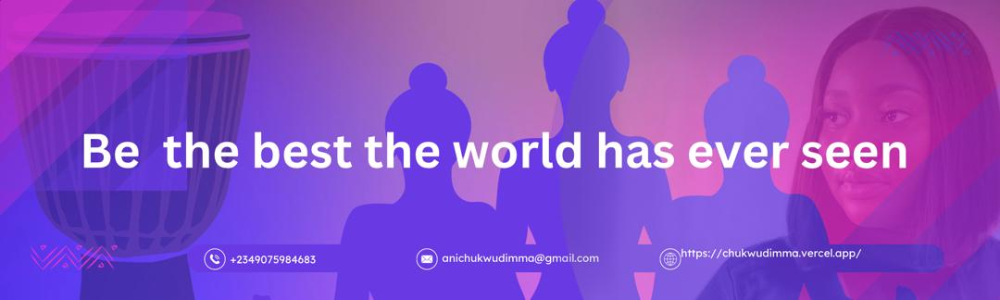

<h1 align ="center"> HELLO 👋 I'm Chukwudimma</h1>

## About me👱

- All About me is on my website at **[MY WEBSITE](https://chukwudimma.vercel.app/)**
  
-  🔭 I’m currently working on `Something Exciting`.
  
- 🌱 I’m currently learning `React.js`
  
- 👯 I’m looking to collaborate on `Backend Projects`.
  
- 💬 Ask me about Anything, Except geography & politics
  
- Life Hack: Learn new tech 🔥:and always have a Secrets stash ..... snack What did you think i was giong to say 🎉:
  
- ⚡ Fun fact: i love Reality TV i call it `Trashy entertainment `
  
- 😄 Pronouns: Put yours `optional`

## ⚒️ Technologies and Tools i Use

 

 

  

 
 

  

##❤️ Let's get Connected:

 
     
      
    

## example of My Works 🤯

